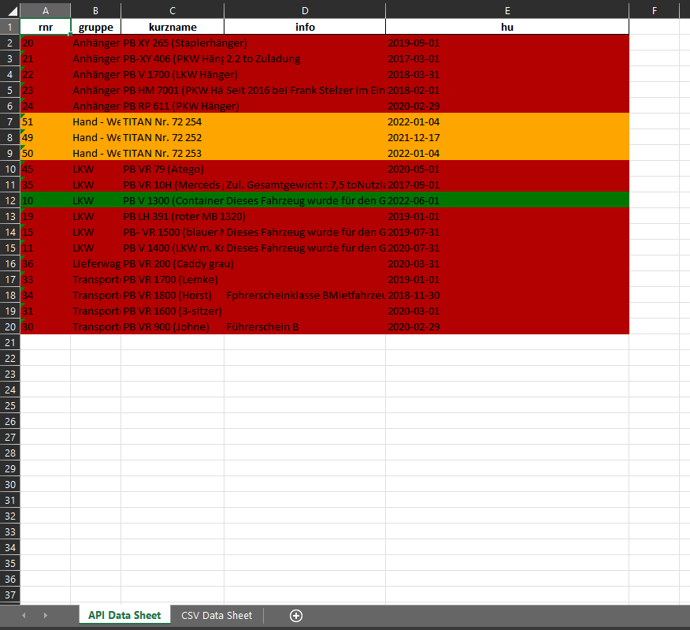
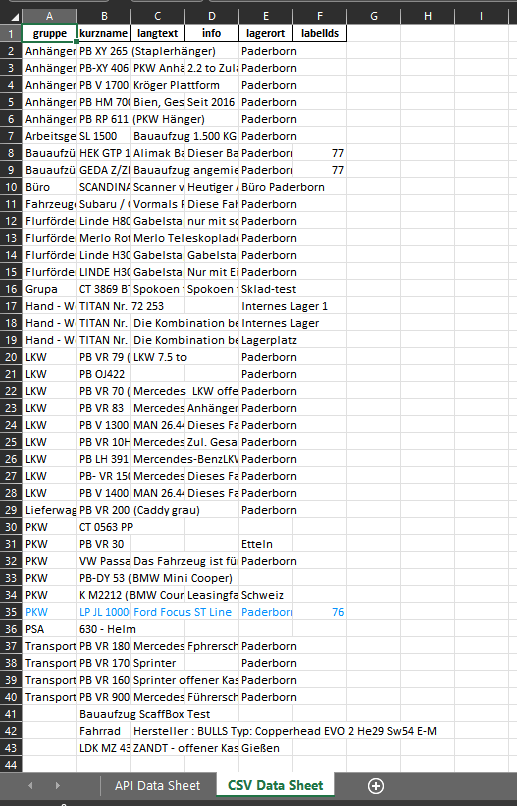

# The Solution of the VERO Digital Solutions's Python Task

---

## How to run the program?

- Make sure you are in the **right project folder**
- Make sure you have a **Python interpreter installed**
- Make sure you have **all needed packages installed**
- Make sure the **imports are correct**
- The program is run via **Command Line** or **Terminal**

If you want to see all data from all columns just pass **'all'** as keyword.
Like this:

`py main.py -k "all" -c True`

### Sidenotes:
 - Columns **rnr** and **gruppe**, that we get in the data from the API, **will always be printed**, because of the task's requirements.
 - While entering the **-k arguments**, place them in a **" "** quote and **separate them with spaces**.

---

## Sample test:

`py main.py -k "info kurzname hu" -c True`

## Output:

The program will create an Excel file name **vehicles_{current_date_iso_formatted}.xlsx**

#### Its output:

